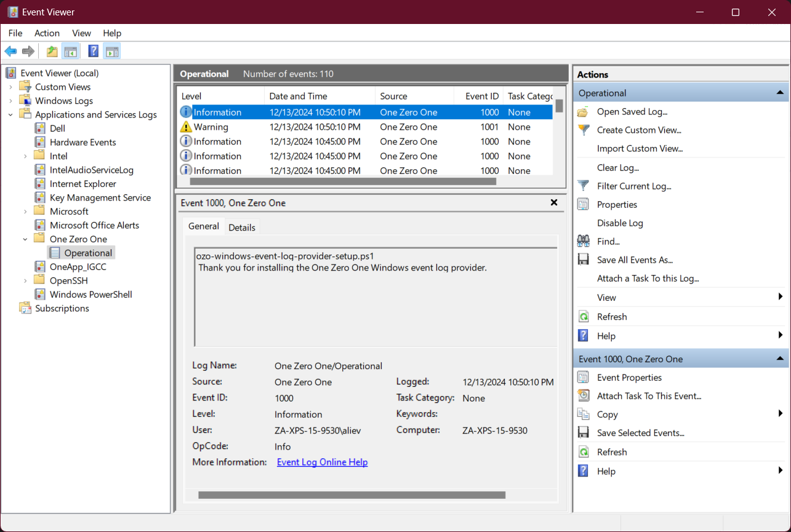

# OZO Windows Event Log Provider Usage Guide



_The Windows Event Viewer showing the "One Zero One" event provider._

## Overview
The _One Zero One_ Windows event log provider can be viewed by opening Windows Event Viewer and navigating to _Applications and Services Logs > One Zero One > Operational_. It provides three event IDs and no categories. For guidance on installing the One Zero One Windows event log provider, please see [README.md](README.md)

## Event IDs
|Event ID|Display Name|Message format|
|--------|------------|--------------|
|`1000`|Information|`%1`<br>`%2`|
|`1001`|Warning|`%1`<br>`%2`|
|`1002`|Error|`%1`<br>`%2`|

## Writing to the Provider
You can write to this provider with any language that supports [Event Tracing for Windows](https://learn.microsoft.com/en-us/archive/msdn-magazine/2007/april/event-tracing-improve-debugging-and-performance-tuning-with-etw).

### PowerShell Example
The optimal method for leveraging this provider is to use the complementary [`OZOLogger`](https://github.com/onezeroone-dev/OZOLogger-PowerShell-Module/blob/main/README.md) module (which is installed along with the provider). When using this module, you assign the result of `New-OZOLogger` to a variable, and then provide a _Message_ and _Level_ to the _Write_ method of the resulting object to send messages to the provider. The _Write_ method inserts the running `PS1` script name as %1 and your _Message_ as %2. The _Level_ is translated to the equivalent event ID.

```powershell
Import-Module OZOLogger
$ozoLoggerObject = New-OZOLogger
$ozoLoggerObject.Write("This is a test message.","Information")
```

Otherwise, you can leverage this provider with the `New-WinEvent` cmdlet where you must provide a list of two strings that will be inserted as %1 and %2 (see the Event ID table above):

```powershell
New-WinEvent -ProviderName "One Zero One" -Id 1000 -Payload "This is line one.","This is line two."
```